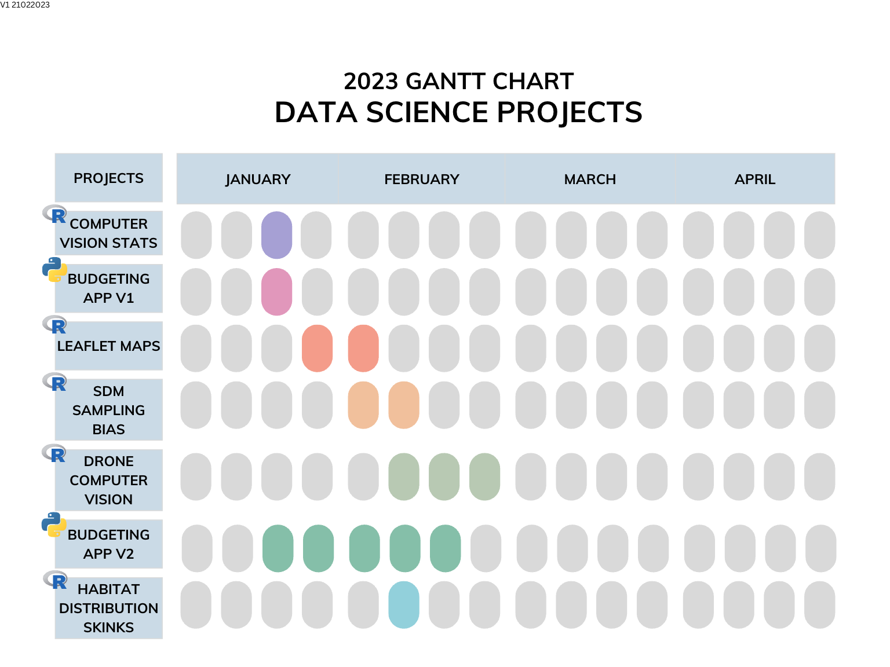

# 🙋🏽‍♂️

 

I am a data scientist at Griffith University developing computer vision solutions for AgTech, conservation and education. I manage and develop code for [FishID](https://ardc.edu.au/project/fishid/), a smart conservation tool that detects and identifies animals in underwater imagery.

